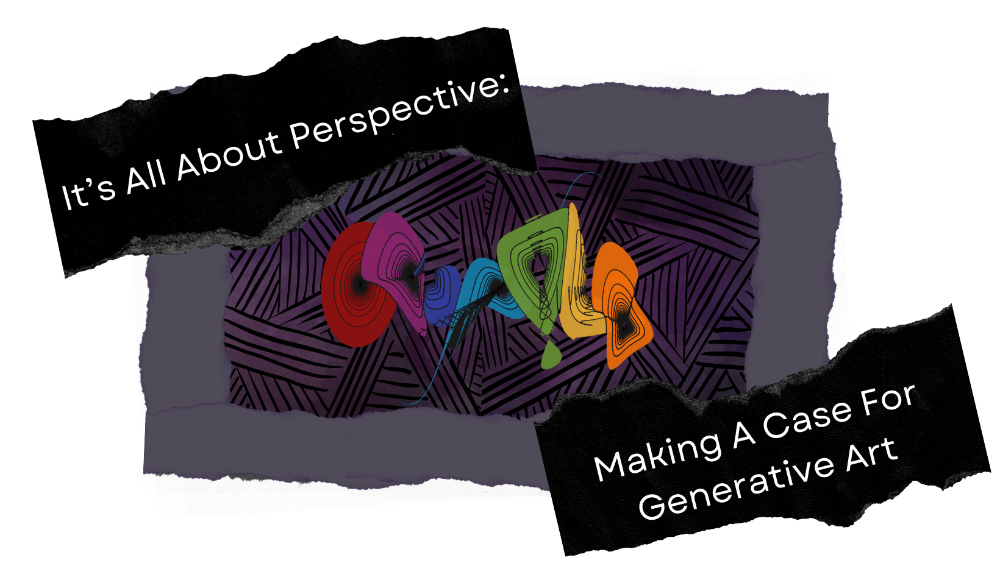

# **Resources for It’s All About Perspective: Making A Case For Generative Art**  

## **About**

This repository contains supplemental resources and materials that
coincide with the *“It’s All About Perspective: Making A Case For
Generative Art”* talk at
[Posit::conf(2023)](https://reg.conf.posit.co/flow/posit/positconf23/attendee-portal/page/sessioncatalog?mkt_tok=NzA5LU5YTi03MDYAAAGMOwicGFr63OfPLW6459w4ZAZLBSqhiiUtSbxyBjSRYaSLYKwQtkx9m5FmTJtCnuXqcFpXkHjL7m4dAHmehJo0s1Zq3KTYQvqE3cV1o9Rdp-Q).

*“It’s All About Perspective”* is a retrospective journey that aims to
invite participants to learn about generative art while focusing on
“why” people should create it and its potential place in Data Science.
This talk is suitable for all disciplines and artistic abilities. This
talk aims to expand the participant’s perspective on generative art with
the following concepts: 

- What is generative art and how can it be created in R or Python

- Justifications for generative art within Data Science

- Examples of programming skills that are transferable between
  generative art and pragmatic data science projects

 

This repository serves as a resource for relevant supplemental code,
materials, and talks for those seeking to learn more about generative
art.

------------------------------------------------------------------------

## **Slides and Talk Recording**

The slides for *“It’s All About Perspective”* can be found on the
repository
[here](https://meghansaha.github.io/a_case_for_genart/#/title-slide).

 

This talk is being presented on September 20th 2023, 1:00 PM
CDT at the Hyatt Regency Chicago (Chicago, Illinois) United States. A
recording of this talk will be provided here when available

------------------------------------------------------------------------

## **Talk Example Code**

- [Python Orange Single Line Example](code_examples/orange_line_ex.py)

- [R Orange Single Line Example](code_examples/orange_line_ex.R)

- [Python Cityscape Example](code_examples/cityscape_ex.py)

- [R Cityscape Example](code_examples/cityscape_ex.R)

------------------------------------------------------------------------

## **Previous Code For Inspiration**

- [25 Days of rtistry
  Repository](https://github.com/Meghansaha/25DaysofRtistry)

- [Genuary 2023 Submission
  Repository](https://meghansaha.github.io/genuary_subs/)

- [Bars
  Example](https://github.com/Meghansaha/Functions_in_Rtistry/blob/master/scripts/bars_example.R) -
  (An example on using Purrr functions for Rtistry)

## **Previous Talks and Slides**

- [Intro to Rtistry Using ggplot2 in R Talk](https://lnkd.in/gDcQTK5d)

- [Intro to Rtistry Using ggplot2 in R Slides](https://lnkd.in/ghGDreS8)

- [Functions in Rtistry
  Slides](https://github.com/Meghansaha/Functions_in_Rtistry)

- [Collages and Patterns
  Talk](https://github.com/Meghansaha/collages_and_patterns/tree/master)

- [Collages and Patterns
  Slides](https://meghansaha.github.io/collages_and_patterns/#/title-slide)

------------------------------------------------------------------------

## **Previous Blog Posts**

- [Thinking Outside the Grid - A “bare bones” intro to Rtistry concepts
  in R using
  ggplot.](https://www.thetidytrekker.com/post/thinking-outside-the-grid)

- [Making Waves in ggplot: An Rtistry
  Tutorial](https://thetidytrekker.com/post/making-waves/making-waves)

------------------------------------------------------------------------

## **Other Resources**

- [artpack](https://meghansaha.github.io/artpack/) Package

- “[Anatomy of Generative
  Art](https://github.com/Ijeamakaanyene/anatomy_of_generative_art)”
  Talk and Repository- [Ijemaka Anyene](https://ijeamaka.art/portfolio/)

- “[Art From Code](https://art-from-code.netlify.app/)” Workshop
  Materials - [Danielle Navarro](https://djnavarro.net/)
